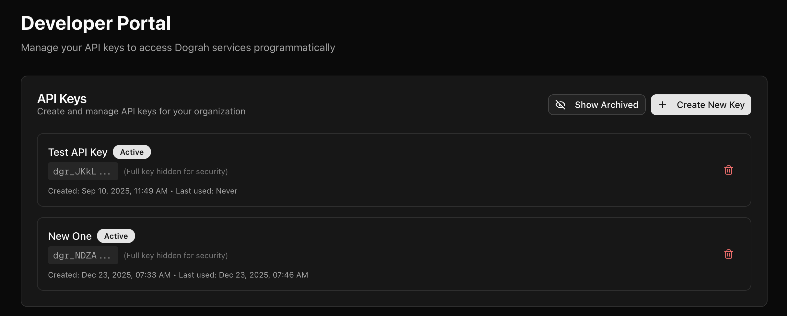
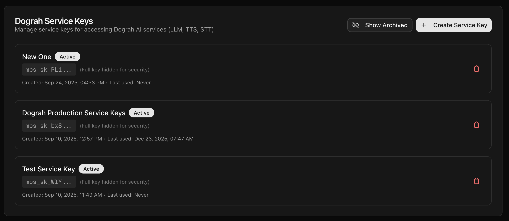

The option to create the Keys are in https://app.dograh.com/api-keys if you are using hosted version, or http://localhost:3010/api-keys if you are using the self hosted version.

### API Keys
API keys can be used to trigger a voice agent from an external system, like n8n or programatically from your other workflows. In order to generate that, you can go to `/api-keys` and create a new key. 

Please note that you must copy and keep the API key secretly, since this is the only time that you would be able to copy it. If you lose it, you can always delete that, if its not being used anywhere, and create a new API key. 

### Service Keys
Service Keys are the keys which you generate to be used in [Model Configurations](inference-providers). In order to generate that, you can go to `/api-keys` and create a new key. 

