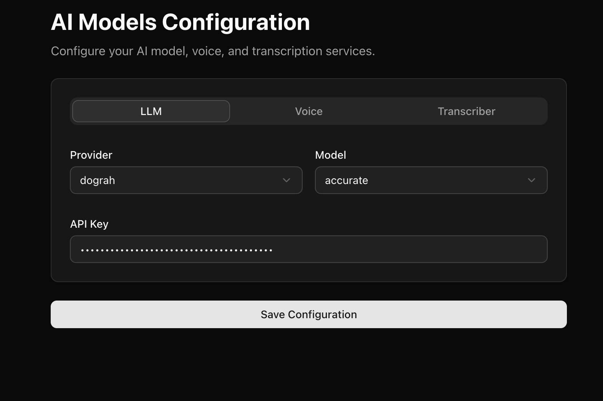

## Configure Models
Dograh Platform ships with its own models by default. When you sign up on https://app.dograh.com or you setup the platform on your self hosted infrastructure, you get some Dograh model credits by default. 

If you wish to change the models to a provider of your own choice, ou can go to `https://app.dograh.com/model-configurations` if you are on hosted version of Dograh or go to `http://localhost:3010/model-configurations` if you are running Dograh locally.

You can see the configuration for the inference provider in the following screenshot.

You can select the provider from the dropdown and configure the API key, model, etc. For Dograh, you can see [Service Keys](api-keys) documentation for instructions on how to create Service Keys to be used in Model Configuration.

Next there are some in depth documentation of various AI Models that you can configure. 