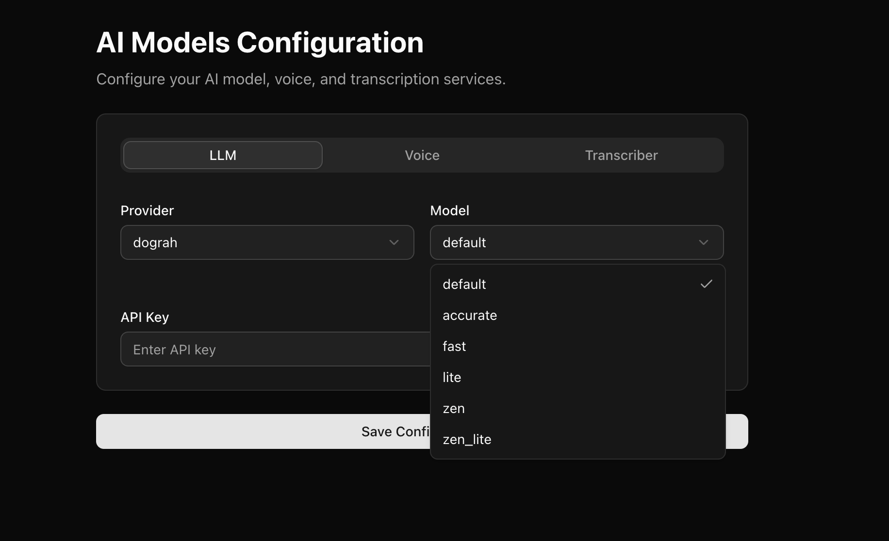
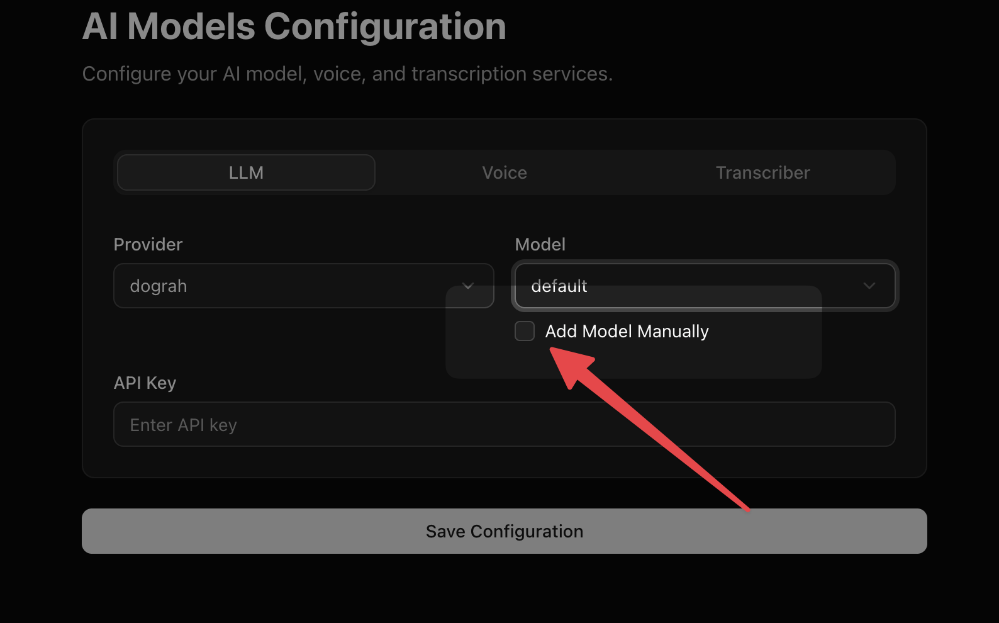

You can currently use OpenAI, Google, Groq, Azure and Dograh LLMs in LLM configuration. There are some models provided by default for you to choose from the drop down. 

If you don't find a model in the drop down, you can always add a model manually.

