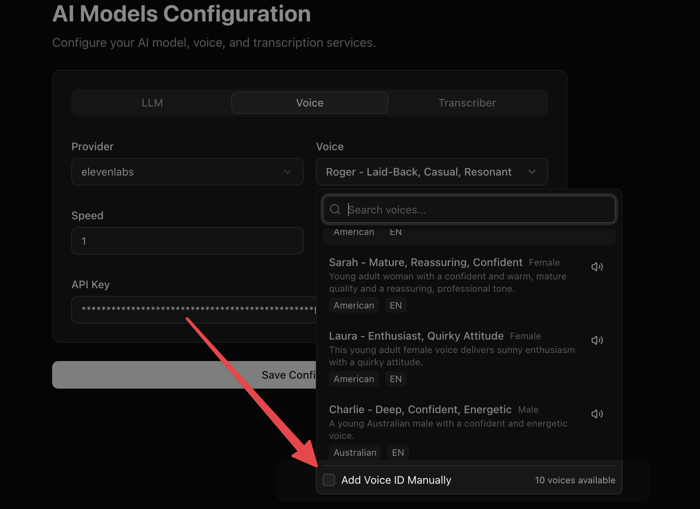

Dograh platform ships with Elevenlabs, Deepgram, OpenAI and Dograh TTS engines by default. There are some voices from the providers that we ship by default. You can refer to the providers API documentation to select a voice ID thats most relevant for your language requirement.

If you dont find your favourite voice, you can always add the voice ID manually.

