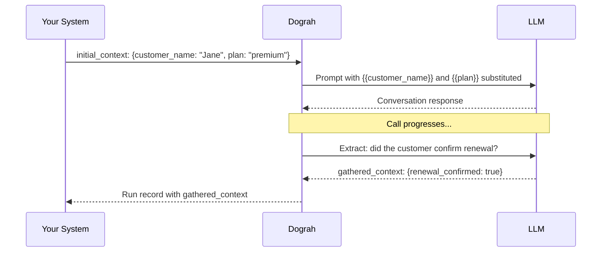

Dograh has a simple data model for passing information through a call. Understanding it is key to building agents that feel personalised and to extracting useful results after a call.

## The three context objects

```
initial_context ──► Agent ──► gathered_context
                       │
                 [template variables](/voice-agent/template-variables)
                 (used in prompts)
```

### initial_context

Data available to the agent before the call starts — the contact's name, account details, appointment information, anything the agent should know upfront. It can be set from several places:

- **API trigger** — pass it in the request body when calling `POST /public/agent/{uuid}` or `POST /telephony/initiate-call`
- **Campaign CSV** — columns beyond `phone_number` automatically become `initial_context` fields for each contact's call
- **Dashboard** — set default template context variables on the agent, used when no external context is provided

```json
{
  "phone_number": "+14155550100",
  "initial_context": {
    "customer_name": "Jane Smith",
    "plan": "premium",
    "renewal_date": "April 1"
  }
}
```

### Template variables

Values from `initial_context` are available in your agent's prompt using `{{double_brace}}` syntax.

```
You are calling {{customer_name}} about their {{plan}} plan,
which renews on {{renewal_date}}. Be friendly and confirm
whether they'd like to continue.
```

When the call starts, Dograh substitutes the values before sending the prompt to the LLM — so the agent speaks naturally as if it already knows the contact.

### gathered_context

Data the agent collects *during* the call. You configure what to extract in the agent node's extraction settings — each variable has a name, type, and a prompt that tells the LLM what to look for.


`gathered_context` is returned in the run record after the call completes and is available in [webhook payloads](/developer/webhooks) for downstream processing.

## Data flow example



## Where variables are available

| Location | Variables available |
|---|---|
| Agent node prompts | `initial_context` fields via `{{variable_name}}` |
| Edge conditions | Evaluated against the live conversation — no explicit variable syntax needed |
| Webhook payload templates | All context objects via `{{initial_context.field}}`, `{{gathered_context.field}}` etc. |
| Campaign CSV columns | CSV columns beyond `phone_number` become `initial_context` fields automatically |
