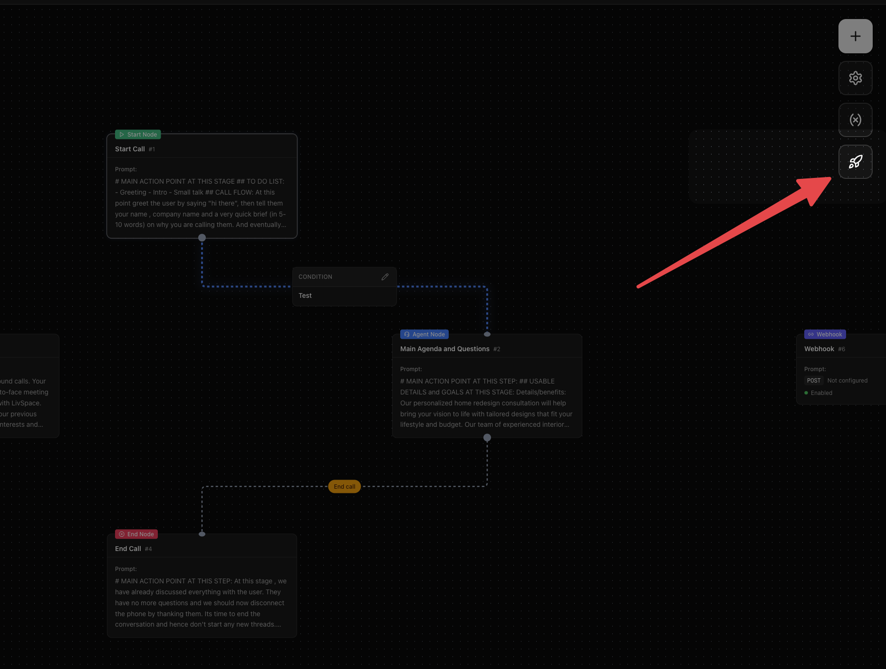
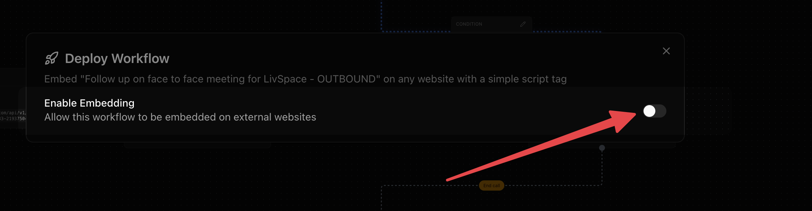

### How to deploy
You can go to your voice agent and Enable Embedding of the Voice Agent on any external website.

Step 1: Go to Deploy Agent

Step 2: Enable Embedding

Step 3: Configure the Widget. Select either floating or inline widget

Step 4: Copy the code into your Web Page and test your agent. 