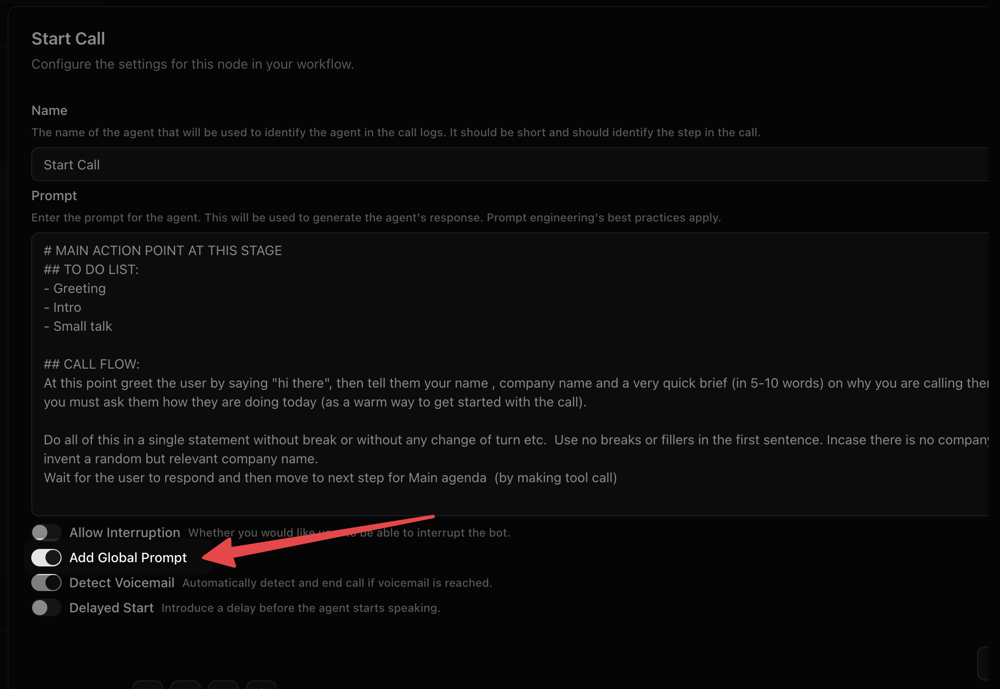

<Note>
You should have only one Global node per Voice Agent.
</Note>

This node typically contains common instructions, that the Voice Agent should always follow, like tone of the conversation, any objection handling etc. 
