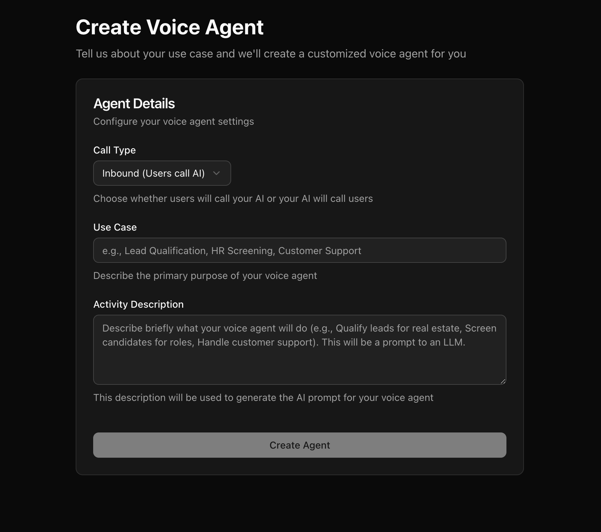

We provide an Agent which quickly helps you get started by creating a voice agent with default prompts and pathways. You can provide inputs like whether you need an "Inbound" or "Outbound" voice agent. You can also provide your use case, and description of what the voice agent should be doing. Your inputs will be sent to an LLM to generate the voice agent, so the better you can describe your use case, the better the starting agent will be created for you. 

Once you create your Voice Agent using our Agent builder, you would be taken to the Agent, where you would have an option to test the agent using "Web Call" or "Phone Call". You can also modify the prompts of the Agent to suit it to your use case better. 